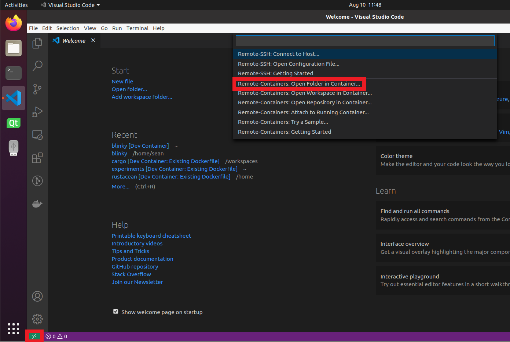
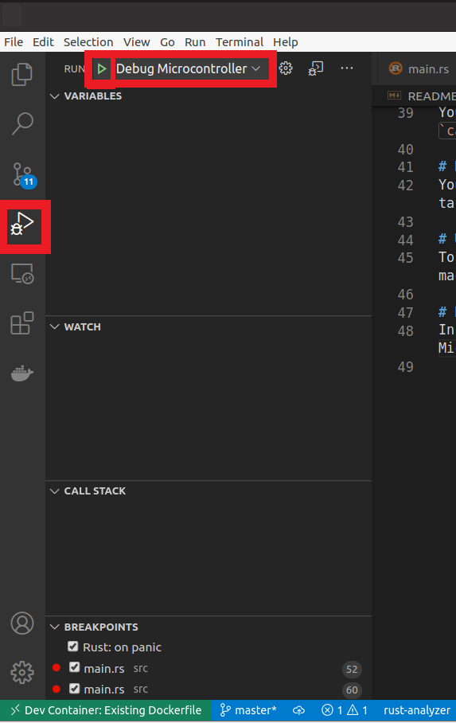
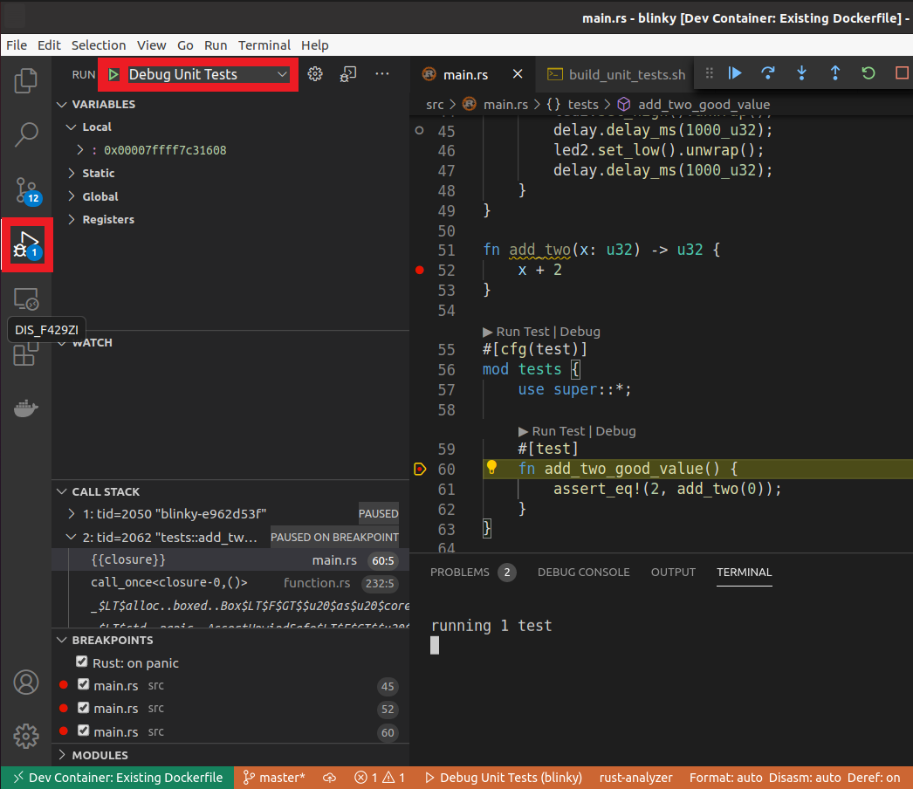

# Blinky
A simple starting point for bare metal rust projects. This repository ships with an environment that allows cross compilation, flashing the target device, remote debugging, local unit testing, local coverage reports, and an example for continuous integration. The environment was created with a [STM32F429I Discovery Board](https://www.st.com/content/st_com/en/products/evaluation-tools/product-evaluation-tools/mcu-mpu-eval-tools/stm32-mcu-mpu-eval-tools/stm32-discovery-kits/32f429idiscovery.html) in mind but can be easily configured to accommodate a different device. The remainder of the readme shall provide instructions for how to get the environment up and running, how to use the tools, and provide explanation for how some environment features work. 

Note: Much of the environment setup has been automated using docker following the instructions in the [embedded rust discovery book](https://rust-embedded.github.io/discovery/).

# Requirements
 - A linux development environment
 - [Docker](https://docs.docker.com/engine/install/)
 - [VSCode](https://code.visualstudio.com/)
 - VSCode Extention: [Remote - Containers](https://marketplace.visualstudio.com/items?itemName=ms-vscode-remote.remote-containers)

The remaining instructions will assume you have these requirements correctly installed.

# Setup
1. In your linux environment, create a udev rule following the instructions [here](https://rust-embedded.github.io/discovery/03-setup/linux.html#udev-rules). 

    Notes
    - The udev rule allows the target device to be flashed without root privileges.
    - It is convenient, but not required, to create a symbolic link to your device using the `SYMLINK` key. This allows you to refer to your device under a static name rather than dynamic numbers.
    - The udev rule used for the ST on board debugger was specified in the `/etc/udev/rules.d/99-openocd.rules` file and is as follows
        ```
        # STM32F3DISCOVERY rev A/B - ST-LINK/V2
        ATTRS{idVendor}=="0483", ATTRS{idProduct}=="3748", MODE:="0666", SYMLINK+="ST-LINK-V2"

        # STM32F3DISCOVERY rev C+ - ST-LINK/V2-1
        ATTRS{idVendor}=="0483", ATTRS{idProduct}=="374b", MODE:="0666", SYMLINK+="ST-LINK-V2-1"
        ```
    Your udev rule may differ if you are not using ST Hardware.

2. Open VSCode.

3. Open the repository within a remote container by selecting the green `><` icon in the bottom left corner and select `Remote-Containers: Reopen in Container`. 

4. Select the directory containing the `Dockerfile` of this repository. VSCode should reopen and begin building the docker image for the environment. This can take up to 5 minutes the first time.

Congratulations. You should now have a fully functional environment.

# Environment Overview
Most of the configurable items within this repository are in the `scripts` directory. These scripts simply serve as a way of centralizing most configurable items to a single directory and allowing many tasks (such as linting and debugging) to require minimum setup and be highly configurable. Its also worth noting that many of these scripts simply invoke cargo, the rust build system, for more detail on how cargo works feel free to refer to the cargo book.

https://doc.rust-lang.org/cargo/

# Checking the project compiles
Suppose you have multiple builds for a project. In the case of this particular repo, there is a "stm32f407" build and a "test" build. The "stm32f407" build is meant for the actual embedded device, while the "test" build is meant to run unit tests on the host development machine.

Each of these builds have a check to make sure that they will even compile. You can see the check for these builds in the `scripts/check` directory. One script worth noting is `scripts/check/all.py`. 

`all.py` simply goes though all the scripts in the check directory (besides itself) and runs them. `all.py` integrates with other features of the environment such as linting, and continuous integration. Getting your own builds to integrate with the linting and continuous integration is as easy as adding your own script to the `check` directory. 

`all.py` will be called from the continuous integration and linting processes and will include checks for your own builds.

# Building
Building is similar to checking. We specify an invocation to cargo within a script, and then use that script to expand functionality of the programming environment. In this case, the functionality of the environment we are expanding is making sure our code always compiles before running the debugger. Nothing is more frustrating than discovering bugs are occurring because of an out of date executable.

To add this functionality to your own builds, simply specify your own build within the `scripts/build` directory. Before debuggers are invoked, `scripts/build/all.py` is called to ensure that all executables are up to date.

If for some reason you wish to disable the executables being built before debugging, you can disable it in the `.vscode/launch.json` file.

# Running the executable on the target device
Simply plug in the device and run the `scripts/run/stm32f407.sh` script. If you are using a device other than the *stm32f407 discovery board* see the configurations file category, to see what else needs to change. You will also need to use a different hardware abstraction layer. It is suggested, but required, to use one of the hardware abstraction layers provided by the rust embedded work group. See 

 - https://github.com/rust-embedded/awesome-embedded-rust#hal-implementation-crates
- https://github.com/rust-embedded/awesome-embedded-rust#board-support-crates

# Unit testing
To compile and run unit tests on your local machine run the `scripts/test/local.sh` script. This script serves as a convenience to the programmer and is also invoked within continuous integration.

# Debugging Remote Device
In VSCode, press the debugger icon, select `Debug Microcontroller`, and press the play button.


This will load the program and stop at the entry point of the program.

# Debugging Unit Tests
Simply place a breakpoint and press the debug icon hovering over the test you wish to debug 

# Configuration Files
A brief description of configuration files for the environment and what fields that may need to change from project to project.

- [.cargo/config.toml](https://doc.rust-lang.org/cargo/reference/config.html) - Specifies default arguments to cargo when you run `cargo build` and `cargo run`. 

    `rustflags` may need to change depending on the hardware abstraction layer you are using. Appropriate configuration of the `rustflags` can usually be found in the hardware abstraction layer readme.

- [devcontainer.json](https://aka.ms/vscode-remote/devcontainer.json) - Specifies how the docker container should be run and VSCode extentions to be installed.

    `extentions` may change between projects.

    `postStartCommand` calls the `scripts/startup/openocd.sh` script on startup. Configurations for the `openocd` invocation will need to change depending on the hardware you are using. See
    https://github.com/ntfreak/openocd/blob/master/README for valid interface and target options.


- [.vscode/launch.json](https://go.microsoft.com/fwlink/?linkid=830387) - Stores configurations for running the debuggers.

- [.vscode/settings.json](https://rust-analyzer.github.io/manual.html) - Stores configuration options for rust-analyzer (process that runs in the background that provides a pleasurable ide experience).

- [.vscode/tasks.json](https://code.visualstudio.com/Docs/editor/tasks) - Stores build tasks for the debugger and launches a linter specified at `scripts/startup/watch.sh`.

- [Dockerfile](https://docs.docker.com/engine/reference/builder/) - Specifies tools to be installed in the environment.
- `memory.x` - information specifying memory layout of the board.
    
    `memory.x` for the board can usually be found on github. See...
    
    https://github.com/stm32-rs

    https://github.com/nrf-rs/nrf-hal

- `run.gdb` - Specifies initial gdb commands to run when `cargo run` is used.

# Known Limitations
You must opt into tasks running in the background for each VSCode workspace. This means auto linting will not be automatically enabled the first time you open this project in VSCode. To enable this, manually run the `Watch files for linting task` by pressing `ctrl+shift+P` -> `Tasks: run task` -> `Watch files for linting`. A pop up should appear in the bottom right saying
```txt
This folder has tasks (Watch files for linting) defined in 'tasks.json' that run automatically when you open this folder. Do you allow automatic tasks to run when you open this folder?
```
select `Allow and run`